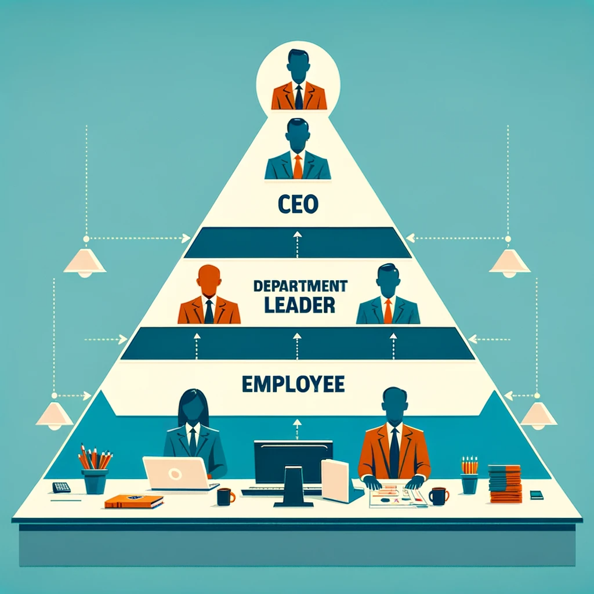

# Holakratie

---

## Warum Veränderung notwendig ist

"85% der Mitarbeiter weltweit fühlen sich nicht engagiert bei ihrer Arbeit."

---

## Einführung in eine neue Ära

Holakratie ist eine transformative Methode, die Organisationen hilft, agiler, transparenter und anpassungsfähiger zu werden.

---

## Was ist Holakratie?

Holakratie ist ein System der Organisationsführung, das herkömmliches Management durch selbstorganisierende Teams ersetzt.

---

## 

## Kernprinzipien der Holakratie

- Dezentralisierung von Entscheidungen
- Rollen statt Jobtitel
- Flexibilität und Anpassungsfähigkeit

---

## Wie funktioniert Holakratie?

- Kreise: Teams mit spezifischen Funktionen
- Rollen: Dynamisch und anpassungsfähig
- Governance-Meetings: Entscheidungsfindung und Anpassung von Rollen

---

## Grenzen traditioneller Hierarchien

- Langsame Entscheidungsfindung
- Geringe Flexibilität
- Mangelnde Mitarbeiterbeteiligung

---

## 

## Vorteile der Holakratie

- Schnellere Anpassung
- Höhere Mitarbeiterzufriedenheit
- Effiziente Entscheidungsfindung

---

## Holakratie in der Praxis

### Mercedes-Benz.io GmbH

- Branche: EDV/IT
- Mitarbeiterzahl: 220
- Holacracy im Einsatz seit: 2016

---

## Erste Schritte zur Implementierung

- Verständnisbildung und Schulung
- Festlegung von Kreisen und Rollen
- Schaffung einer holakratischen Verfassung

---

---

## Überwindung von Herausforderungen

- Umgang mit Widerständen
- Coaching und Mentoring
- Regelmäßiges Feedback

---

## Langfristige Integration

- Fortlaufende Bewertung und Entwicklung
- Kulturwandel
- Einbeziehung aller Mitarbeiter

---

## Zusammenfassung

Holakratie bietet eine flexible und effiziente Alternative zu traditionellen hierarchischen Strukturen.

---

## Ich lade Sie ein, Ihre Gedanken zu teilen und Fragen zu stellen.

---

## Quellen

1. «Holokratie» statt hierarchie? - Loopings. (o. D.). loopings. https://loopings.ch/magazin/holokratie-statt-hierarchie
2. Tißler, J. (2019, 4. März). Holacracy in Theorie und Praxis: 7 Unternehmen im Interview | UPLOAD. UPLOAD Magazin. https://upload-magazin.de/32465-holacracy-holakratie/
3. Weirauch, L., Galliker, S. & Elfering, A. (2023). Holacracy, a modern form of organizational governance predictors for person-organization-fit and job satisfaction. Frontiers in Psychology, 13. https://doi.org/10.3389/fpsyg.2022.1021545
